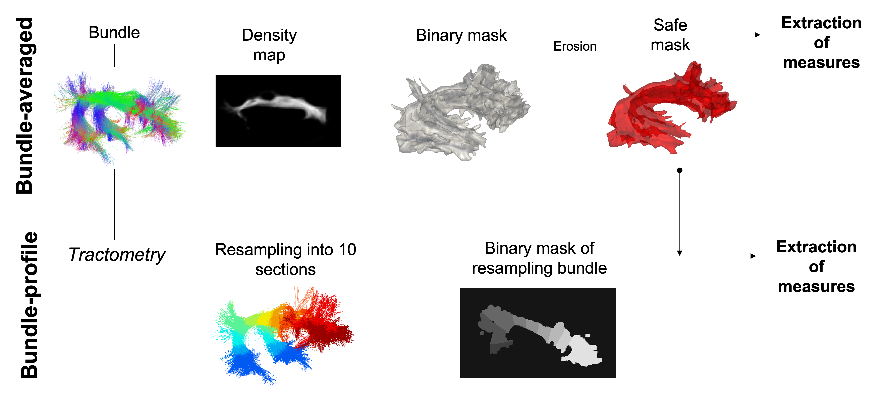

Bundles
=======

Bundles segmentation
--------------------

- For the segmentation of bundles we used `RecobundlesX <https://github.com/scilus/rbx_flow>`__

.. image:: bundles_segmentation.png
   :align: center

Bundles profiling
--------------------

- For the profiling bundles we used `Tractometry flow  <https://github.com/scilus/tractometry_flow>`__

.. image:: bundles_profiling.png
   :align: center

Bundles reproducibility
------------------------

To minimize the impact of the variability of reconstruction by tractography of the bundles on the measurements extracted from them, 
we evaluate the reproducibility as described in `Rheault et al. 2022 <https://doi.org/10.1002/hbm.25777>`_ (see also `Rheault et al. 2020 <https://doi.org/10.1002/hbm.24917>`_). 

Dice score, density correlation and streamlines and voxels adjency from all pairwise combinations were used to provide an estimate of the 
agreement between segmentations of the same bundle across sessions.

See section  `Bundles reproducibility <https://high-frequency-mri-database-supplementary.readthedocs.io/en/latest/results/bundles_reproductibility.html>`_
for results. 

Bundles masking for consistency analysis
-----------------------------------------

- For the operations to build mask of bundles we used (`SCIL`_) scripts.

 .. _SCIL: http://scil.usherbrooke.ca/en/
 

