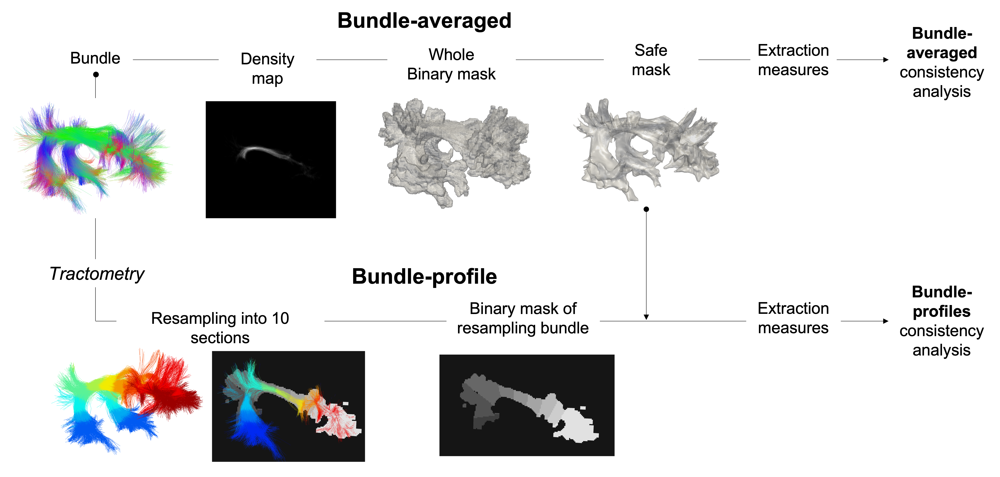

Consistency analysis
====================

The consistency analyses of each measure were carried out at the voxel-level within the bundles mask in common 
space using this script (script alex).
The individual masks corresponding to each subject and session in the common space were provided as input. 
The overlap between masks across sessions and subjects was then performed as described in the consistency measures. 
Incomplete overlap of mask between subjects and sessions was compensated by densifying each measure in the affected 
regions voxel-wise, using the average value estimated from the available subjects or sessions. The averaged masks used 
for the computation of statistical measurements are then obtained subject-wise or session-wise by mathematical union. 

Bundle-averaged 
---------------

For each bundle, a density map was computed and used to generate a binary mask of the whole bundle. 
To minimize the effect of partial volume, each whole bundle mask was eroded by one voxel to generate 
a conservative bundle mask that we called the “safe mask”. 

Bundle-profile
---------------

To generate the bundle-profile (also called track-profiles), Tractometry was applied to each subject-specific 
bundle to obtain 10 binary mask corresponding to 10 equidistant sections. Each binary mask was then intersected
with the safe mask. 

Left and right masks were merged for each average and section bundle mask. 
Finally, DTI, HARDI, NODDI and MTI measures were extracted for each average and segment mask along the bundle 
for each bundle over session.

Consistency analysis
--------------------
 

Reliability 
~~~~~~~~~~~

Image Intra-Class Correlation coefficient (I2C2, Shou et al., 2014), a generalization of the Intra-Class Correlation 
coefficient (ICC, Koo and Li, 2016, Bruton et al., 2000) to n-dimensional images (one-way random effect, absolute agreement)
was used to evaluate the reliability of MRI measurements.  

Variability 
~~~~~~~~~~~~

The variability induced by within-subject and between-subject effects on the measures was quantified using 
two coefficients of variation per measure: Within- abd Between-Variability.  

  * Within-Variability (CVw)
  CVw was used to evaluate the dispersion of observations when repeatedly measuring a single individual (i.e., reproducibility). 
  It represents the amount of random error or noise contributing to the measure. 
  The CVw is first estimated per subject over their respective imaging sessions and then averaged across session.
  
  * Between-Variability (CVb)
  CVb was used to evaluate the sample heterogeneity. 
  The CVb is obtained by first averaging each subject session-wise, to then estimate the CV over those averages.
  

