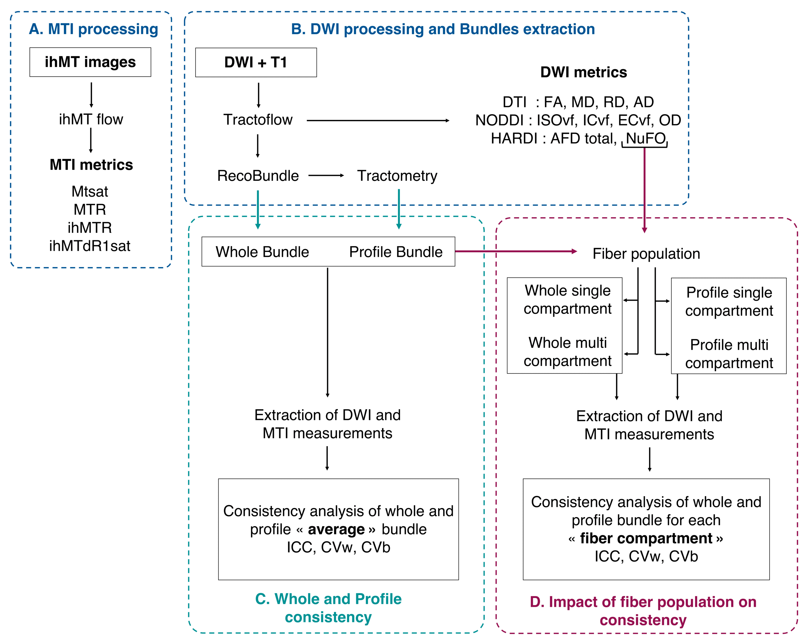

Analysis pipeline
=================

Processing
---------------
For MRI images processing all processing tools were availables
on `SCIL <https://github.com/scilus>`__.
See https://scil-documentation.readthedocs.io/ for installation and documentation.

- For DWI and T1 processing : `Tractoflow <https://github.com/scilus/tractoflow>`__ and `NODDI <https://github.com/scilus/noddi_flow>`__
- For ihMT processing : `ihMTflow <https://github.com/scilus/ihmtflow>`__

Table describe all metrics maps which will be evaluated.

+-------------------------------+-------------------------------------------+
| Tools                         | Generated images                          |
+===============================+===========================================+
| Tractoflow - DTI              | Fractional anisotropy (FA)                |
+-------------------------------+--------------------+----------------------+
|                               | Mean Diffusivity (MD)                     |
+-------------------------------+--------------------+----------------------+
|                               | Radial Diffusivity (AD)                   |
+-------------------------------+--------------------+----------------------+
|                               | Axial Diffusivity (AD)                    |
+-------------------------------+--------------------+----------------------+
| Tractoflow - HARDI            | Apparent fiber density total (AFD total)  |
+-------------------------------+--------------------+----------------------+
|                               | Number of fober direction (NuFO)          |
+-------------------------------+--------------------+----------------------+
| NODDI flow                    | Intra-cellular volume fraction (ICvf)     |
+-------------------------------+--------------------+----------------------+
|                               | Extra-cellular volume fraction (ICvf)     |
+-------------------------------+--------------------+----------------------+
|                               | Isotropic volume fraction (ISOvf)         |
+-------------------------------+--------------------+----------------------+
|                               | Orientation direction (OD)                |
+-------------------------------+--------------------+----------------------+
| ihMT flow                     | ihMT ratio (ihMTR)                        |
+-------------------------------+--------------------+----------------------+
|                               | ihMT delta R1 saturation (ihMTdR1sat)     |
+-------------------------------+--------------------+----------------------+
|                               | MT ratio (MTR)                            |
+-------------------------------+--------------------+----------------------+
|                               | MT saturation (MTsat)                     |
+-------------------------------+--------------------+----------------------+

- For the segmentation of bundles : `Recobundles <https://github.com/scilus/rbx_flow>`__
- For the profiling bundles : `Tractometry flow  <https://github.com/scilus/tractometry_flow>`__

Quality Control
---------------

After processing, we check our results using `DMRI QC <https://github.com/scilus/dmriqc_flow>`__.

Generate common space from b0 images
------------------------------------
To evaluate the consistency of each measure at the voxel level across the
bundles in the whole brain, we build a common space based on our population.
Common space is generated from b0 images resulting from Tractoflow using
ANTs as follow:

.. code-block:: bash

  buildtemplateparallel.sh -d 3 -o b0_template -g 0.2 -c 2 -j 4 -s CC -r 1 -k 1 -m 100x70x50 -t GR b0*nii.gz

.. note::

   As we used the b0 output from tractoflow, b0 images are already
   pre-processing (including skull stripping, resampling, distorsion correction...),
   see Tractoflow description here https://tractoflow-documentation.readthedocs.io.

To generate mean image for each measure, we run scilpy python script:

.. code-block:: python

  # Mean images (example for FA map)
  scil_image_math.py mean *fa*.nii.gz mean_fa_healthy_control.nii.gz

  # Standard deviation images
  scil_image_math.py sd *fa*.nii.gz sd_fa_healthy_control.nii.gz
  

Bundles segmentation
---------------------

.. image:: bundles_segmentation.png
   :scale: 50 %
   :align: center

Bundles profiling
---------------------

.. image:: bundles_profiling.png
   :scale: 50 %
   :align: center

Consistency analysis
---------------------
The consistency analyses of each measure were carried out at the voxel-level
within the bundles mask using this script (script alex).
